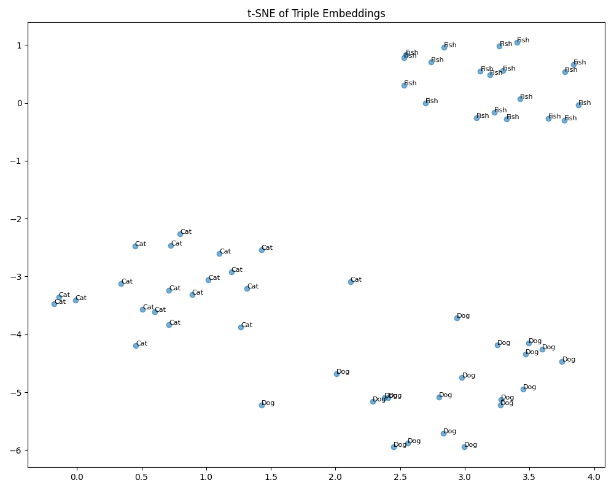
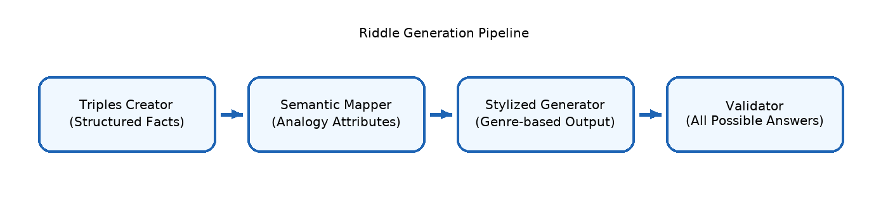

# 🧩 Riddle Quest

RiddleQuest is an end-to-end pipeline that automatically generates high-quality riddles from **structured knowledge**(triples), validates them using a property-based reasoning engine, and produces multiple acceptable answers using a **lookup-based validator**.

The system supports:

- Template-based riddle generation
- Positive & negative clue extraction
- Lookup-driven reasoning and concept scoring
- Automatic candidate answer generation
- Clean JSON I/O pipelines suitable for evaluation & dataset creation

## ⭐ Features
1. **Triple Embedding & Classification**
Generates embeddings for each triple
Computes similarity between concepts
Classifies triples as:
- topic_marker → unique to one concept
- common → shared across concepts
2. **Riddle Generation** (3 Versions)
Version 1 — Topic-Marker Riddles
Uses unique triples of a concept.
```
Example:
I breathe using gills.
I live in water.
I use fins to move.
What am I?
```
Version 2 — Contrast Riddles
Uses common properties + contrasting with another concept.
```
I am furry but not a dog.
What am I?

```
Version 3 — Positive vs Negative Property Riddles
Uses properties to strengthen reasoning.
```
I have whiskers but not retractable claws.
What am I?
```
3. **Symbolic Riddle Validator**
Given a riddle, extracts:
positive clues
negative clues
Then uses lookup dictionaries to identify:
answer
all possible answers (if multiple concepts fit)
Saves to:
```
outputs/riddles_with_answers.json
```
4. **Visualization**
The pipeline can create:
- t-SNE embedding plots
- Similarity maps
- Concept clusters with labels



## Repository structure
```

RiddleQuest/
│
├── triples/
│   └── triples.json
│
├── templates/
│   └── templates.json
│
├── lookup/
│   └── lookup.json
│
├── src/
│   ├── generator.py
│   ├── validator.py
│   └── pipeline.py
│
├── data/
│   └── riddles_with_answers.json
│
├── README.md
└── LICENSE

```


##  Architecture



## ⚙️ Installation

Clone the repository:
```
git clone https://github.com/niharikasriparasa/RiddleQuest.git
cd RiddleQuest

```
Installation

```
pip install -r requirements.txt

```
## 🚀 Usage

Generate riddles
```
python src/generator.py \
    --triples triples/triples.json \
    --templates templates/templates.json
```
Validate riddles
```
python src/validator.py \
    --riddles data/riddles.json \
    --lookup lookup/lookup.json
```
Full pipeline
```
python src/pipeline.py

```
## 🔍 Example Riddle

Input Triple:

```
{
  "triple": "Many fish have a lateral line to detect water movement.",
  "label": "topic_marker"
}

```
Generated Riddle :

```
I can sense movements around me through a special lateral line.
I live in water and use fins for movement.
What am I?

```
Validator Output :

```
{
  "concept": "Fish",
  "riddle": "...",
  "answer": "Fish",
  "possible_answers": ["Fish", "Ray"]
}
```

## ❗Demo

**coming soon**


## 📚 Citations

If you plan to use RiddleQuest for academic work :

```
@inproceedings{parasa2022learningriddles,
  title={Automated Riddle Generation for Learning Resources},
  author={Parasa, Niharika Sri},
  booktitle={Proceedings of the International Workshop on Educational NLP},
  year={2022},
  publisher={ACL},
 
}

```

## 📄 License
This project is licensed under the MIT License – see the LICENSE file.


